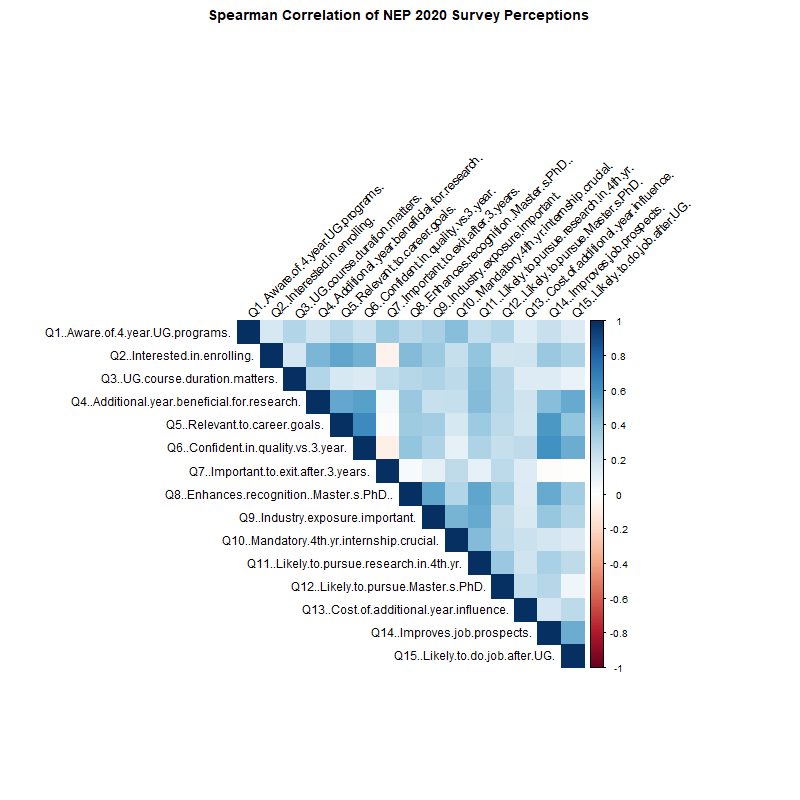

# 📊 NEP-2020-Student-Perceptions

## Project Description

This repository contains a data analysis project exploring undergraduate student behavior and perceptions regarding the 4-year undergraduate program introduced under India's National Education Policy (NEP) 2020. Based on a survey of 500 responses (100 original, 400 simulated via multivariate normal distribution), this project applies Spearman’s Rank Correlation to unpack the underlying relationships between program awareness, career expectations, the value of research/internships, and financial concerns.

---

## 💡 Key Insights

**Awareness and Industry Readiness are Top Priorities**

*   Students reported the highest average score (3.93/5) for awareness of the 4-year program.
*   The mandatory 4th-year internship is the second highest priority (3.80/5), indicating a strong valuation of industry experience.

**Career Relevance Drives Confidence**

*   The strongest positive relationship exists between Relevance to Career Goals (Q5) and Confidence in Program Quality (Q6) with a correlation of 0.63.
*   This is closely followed by the belief that the program Improves Job Prospects (Q14).
*   The intersection of Career Relevance, Confidence, and Job Prospects shows that students inherently trust the program's academic quality if they believe it leads to employment.

**The "Early Exit" Option Has Little Appeal to Core Enrollees**

*   The importance of Exiting after 3 years (Q7) shows slight negative or near-zero correlations with overall Interest in enrolling (Q2) (-0.06) and Confidence in quality (Q6) (-0.08).
*   Students highly interested in the 4-year structure view the 4th year as an essential component.
*   The "exit option" is valued more by those who are skeptical of the new system.

**Research vs. Global Recognition**

*   A strong correlation (0.52) exists between valuing Industry Exposure (Q9) and believing the program Enhances Global Recognition for Master's/PhD (Q8).
*   Students view the 4th year as a practical portfolio builder for higher education rather than just an academic extension.

---

## 🛠 Methodology & Tools

The analysis was conducted using R, leveraging packages such as `readxl`, `dplyr`, `ggplot2`, and `corrplot`. The core methodology includes:

*   Data cleaning and comprehensive numeric conversion to prepare for statistical analysis.
*   Extraction of descriptive statistics (means) to identify the highest-rated survey variables.
*   Execution of Spearman's rank correlation to isolate and rank the strongest positive and negative variable relationships.
*   Generation of a comprehensive correlation matrix and heatmap for visual data exploration.

---

## 🗂 Repository Files

*   **Dataset:** `NEP2020_Survey_Responses.xlsx` contains the 500 survey responses used for this analysis.
*   **Visualizations:** `Correlation_Heatmap.png` visualizes the Spearman correlation between the survey variables.
*   **Script:** `Survekshan.R` contains the R code used for data manipulation, statistical analysis, and visualization.

---

## 📈 Visualizations

